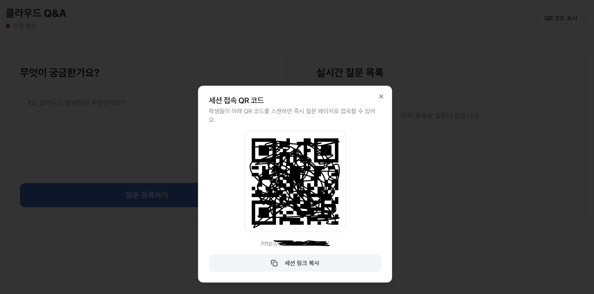
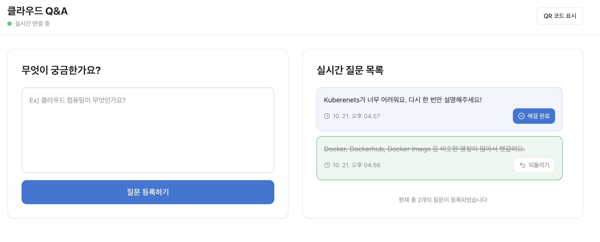

# 🚀 Cloud CI/CD Project

이 프로젝트는 **FastAPI 백엔드**와 **React 프런트엔드**를 기반으로 한 **클라우드 CI/CD 자동화 실습용 웹 애플리케이션**입니다.  
코드 푸시(`git push`) 한 번으로 **GitHub Actions → Docker Hub → EC2**까지 자동 배포되는 파이프라인을 구축했습니다.

---

## ✨ 주요 기능

- 질문 등록 / 조회 / 해결 상태 표시
- QR 코드 기반 세션 공유
- FastAPI + SQLite 백엔드
- React + shadcn UI 프런트엔드
- GitHub Actions + Docker Hub 자동 배포
- EC2에서 docker compose 기반 서비스 운영

---

## 🏗️ Architecture Overview

**전체 동작 흐름 요약**

1. 로컬에서 main 브랜치에 코드 푸시
2. GitHub Actions가 자동 트리거되어 백엔드/프런트엔드 이미지를 빌드
3. 빌드된 이미지를 Docker Hub에 푸시
4. EC2 서버에 SSH로 접속해
   - Docker Hub 로그인
   - 최신 이미지 pull
   - docker compose up 실행
5. FastAPI와 React 컨테이너가 재시작되며 최신 버전으로 배포 완료

> 이 과정을 통해 단 한 번의 push로 전체 배포를 자동화할 수 있습니다.

---

## 🧰 Tech Stack

| 구분         | 기술                                              | 설명                                     |
| ------------ | ------------------------------------------------- | ---------------------------------------- |
| **Frontend** | React, TypeScript, Vite, shadcn/ui, react-qr-code | QR 코드 렌더링 및 UI 구성                |
| **Backend**  | FastAPI, SQLAlchemy, SQLite, APScheduler          | 질문 CRUD 및 자정 자동 정리 스케줄링     |
| **CI/CD**    | GitHub Actions, Docker Hub, Appleboy SSH Action   | 자동 빌드, 이미지 푸시, 원격 배포        |
| **Infra**    | AWS EC2 (Ubuntu), Docker, Docker Compose          | 컨테이너 오케스트레이션 및 서비스 호스팅 |
| **Etc.**     | Intl.DateTimeFormat                               | UTC → KST 시간 변환 처리                 |

---

## ⚙️ CI/CD Flow Overview

1. **Push to main**  
   → GitHub Actions가 자동으로 실행됩니다.

2. **Build & Push Images**  
   → Backend / Frontend Docker 이미지를 빌드하고 Docker Hub에 푸시합니다.

3. **Remote Deployment**  
   → EC2에 SSH로 접속해  
    최신 이미지를 pull 후 `docker compose up -d`로 서비스 재시작합니다.

4. **Service Running**
   - Backend: FastAPI (port 8000)
   - Frontend: React + Nginx (port 5173)

---

## ☁️ CI/CD Components

| 구분               | 역할                     | 위치                           |
| ------------------ | ------------------------ | ------------------------------ |
| **GitHub Actions** | 자동 빌드 및 배포 트리거 | `.github/workflows/deploy.yml` |
| **Docker Hub**     | 빌드된 이미지 저장소     | Remote Registry                |
| **EC2 (Ubuntu)**   | 배포 및 실행 환경        | `/home/ubuntu/cicdproject`     |
| **Docker Compose** | 서비스 통합 실행         | `docker-compose.yml`           |

---

## 🧠 CI/CD Summary

이 프로젝트는 **GitHub Actions → Docker Hub → AWS EC2**로 이어지는  
**완전 자동화된 CI/CD 파이프라인**을 구현했습니다.

- 코드를 푸시하면 자동으로 빌드 및 배포 완료
- Docker Compose를 이용한 일관된 실행 환경
- FastAPI × React 기반의 경량형 클라우드 애플리케이션

---

## 🐳 Docker Configuration 개요

- **Backend 컨테이너**

  - FastAPI 실행 환경 (Python 3.11 기반)
  - SQLite 데이터베이스 사용
  - APScheduler로 매일 00:00 (KST) 데이터 초기화

- **Frontend 컨테이너**

  - React + Vite 기반 정적 빌드
  - Nginx를 통해 정적 파일 서빙
  - QR 코드 생성 및 세션 링크 표시

- **docker-compose.yml**
  - backend와 frontend 두 컨테이너를 함께 관리
  - 포트 매핑
    - 백엔드: 8000
    - 프런트엔드: 5173

---

## 💡 주요 기능 상세

### 1️⃣ 질문 관리

- `/questions` GET → 전체 질문 조회
- `/questions` POST → 질문 등록
- `/questions/{id}` PATCH → 해결 상태 토글

### 2️⃣ 자정 스케줄러

- APScheduler를 통해 매일 00:00 (KST) 이전 데이터 자동 삭제

### 3️⃣ QR 코드 세션 공유

- `react-qr-code`를 사용하여 현재 페이지 URL을 QR 코드로 표시
- “QR 코드 표시” 버튼을 통해 다이얼로그를 열어 공유 가능

### 4️⃣ UI/UX 구성

- 미해결 질문: 일반 배경
- 해결 질문: 연두색 배경 + 취소선
- “해결하기 / 되돌리기” 버튼으로 상태 변경

---

## 📁 Project Structure

```bash
cicdproject/
├── backend/
│ ├── main.py
│ ├── models.py
│ ├── database.py
│ ├── requirements.txt
│ └── Dockerfile
│
├── QR_Code_Question/
│ ├── src/
│ │ ├── components/
│ │ │ ├── QrCodeDialog.tsx
│ │ │ ├── QuestionFeed.tsx
│ │ │ └── SessionHeader.tsx
│ │ └── pages/
│ │ └── Index.tsx
│ ├── package.json
│ └── Dockerfile
│
├── .github/
│ └── workflows/
│ └── deploy.yml
│
├── docker-compose.yml
└── README.md`
```

---

## 🎨 Features Preview

| QR 세션 공유                            |
| --------------------------------------- | -------------- | --- |
|      |
| 질문 목록 UI                            |
| <!--                                    | -------------- | --> |
|  |

---

## 🧪 Run Locally

1. GitHub에서 이 레포지토리를 클론합니다.
2. 프로젝트 루트에서 `docker compose up -d` 명령을 실행합니다.
3. 브라우저에서
   - **Frontend** → `http://localhost:5173`
   - **Backend** → `http://localhost:8000`  
     에 접속하여 테스트할 수 있습니다.

---

## 🌱 Future Improvements

- 중요 키워드 순으로 통계치 제공
- Redis Pub/Sub 기반 실시간 데이터 반영
- MongoDB를 활용한 세션 로그 저장
- GitHub Actions 캐시를 활용한 빌드 속도 개선
- Terraform 기반 IaC(인프라 자동화) 적용

---

## 👤 Author

**Jongho Lee**  
Cloud Software Developer

📧 Email: hopaper2367@naver.com  
🔗 GitHub: [https://github.com/Jakelee99](https://github.com/Jakelee99)
